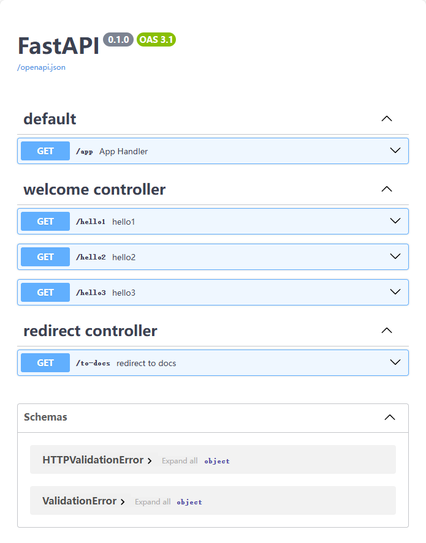
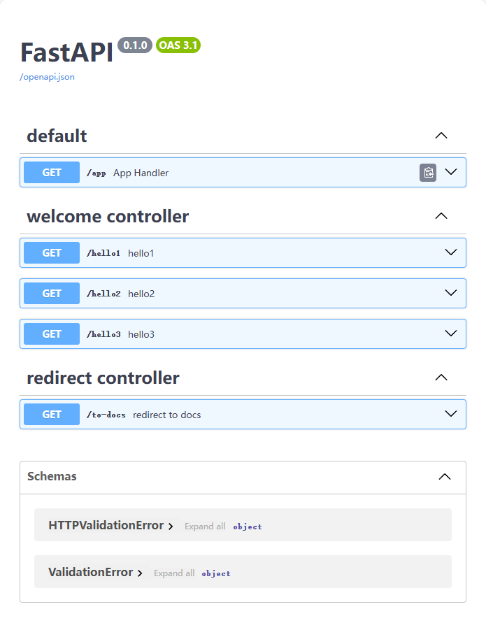

<div align='center'></div>
<div align='center' style="transform:scale(2)"></div>

# :star:features

-   Starter for FastAPI project, faster and easier.

# ⚡Keywords

-   Class based view(CBV) or fucntion based view(FBV).
-   Scan project and autowire services,repositories,components and beans.
-   Public dependencies.
-   ...

# :memo:Quick start

## 1. v1

```python
# /service/WelcomeService.py

from fastapi_boot import Service


@Service
class WelcomeService:
    def welcome(self, num: int):
        return "World" if num > 0 else "FastApiBoot"


```

```python
# /controller/WelcomeController.py

from fastapi import Query, Request
from fastapi.responses import RedirectResponse
from fastapi_boot import Controller, GetMapping, RequestMapping, useDeps, AutoWired
from service.WelcomeService import WelcomeService


# -------------------------------------------------------------------------------------------------------------------- #

# autowired servcie by type
welcome_service = AutoWired(WelcomeService)

# -------------------------------------------------------------------------------------------------------------------- #


# dependency1
def get_headers(request: Request):
    return request.headers


# dependency2
def get_welcome_msg(p: int = Query()):
    return f"Hello {welcome_service.welcome(p)}"


# -------------------------------------------------------------------------------------------------------------------- #


# class based view
@Controller
@RequestMapping() # can delete when path == ''
class WelcomeController:
    @RequestMapping("/hello1", summary="hello1", tags=["welcome controller"])
    def hello1():
        return "Hello World!"

    # isolated container
    @RequestMapping()
    class foo:
        # public dependencies
        headers = useDeps(get_headers)
        msg = useDeps(get_welcome_msg)

        @GetMapping("/hello2", summary="hello2", tags=["welcome controller"])
        def hello2(self):
            return dict(msg=self.msg)

        @GetMapping("/hello3", summary="hello3", tags=["welcome controller"])
        def hello3(self):
            return dict(msg=self.msg, ua=self.headers.get("user-agent", ""))


# function based view
@Controller
@RequestMapping("/to-docs", summary="redirect to docs", tags=["redirect controller"])
def redirect_to_docs():
    return RedirectResponse("./docs")

```

```python
# application.py

import os
from fastapi import FastAPI

from fastapi_boot import FastApiBootApplication

app = FastAPI()


@app.get("/app")
def app_handler():
    return True


@FastApiBootApplication(app)
def main():
    os.system("uvicorn application:app --reload")


if __name__ == "__main__":
    main()

```

<div align='center'></div>

## 2. v2

```python
# /service/WelcomeService.py

from fastapi_boot import Service


@Service
class WelcomeService:
    def welcome(self, num: int):
        return "World" if num > 0 else "FastApiBoot"

```

```python
# /controller/WelcomeController.py

from fastapi import Query, Request
from fastapi.responses import RedirectResponse
from fastapi_boot import Controller, Get, Req, useDep, AutoWired, Prefix
from service.WelcomeService import WelcomeService


# -------------------------------------------------------------------------------------------------------------------- #

# autowired servcie by type
welcome_service = AutoWired(WelcomeService)

# -------------------------------------------------------------------------------------------------------------------- #


# dependency1
def get_headers(request: Request):
    return request.headers


# dependency2
def get_welcome_msg(p: int = Query()):
    return f"Hello {welcome_service.welcome(p)}"


# -------------------------------------------------------------------------------------------------------------------- #


# class based view
@Controller("", tags=["welcome controller"])
class WelcomeController:
    @Req("/hello1", summary="hello1")
    def hello1():
        return "Hello World!"

    # isolated container
    @Prefix()
    class foo:
        # public dependencies
        headers = useDep(get_headers)
        msg = useDep(get_welcome_msg)

        @Get("/hello2", summary="hello2")
        def hello2(self):
            return dict(msg=self.msg)

        @Get("/hello3", summary="hello3")
        def hello3(self):
            return dict(msg=self.msg, ua=self.headers.get("user-agent", ""))


# function based view
@Controller("/to-docs", tags=["redirect controller"]).get(
    "", summary="redirect to docs"
)
def redirect_to_docs():
    return RedirectResponse("./docs")

```

```python
# application.py

from contextlib import asynccontextmanager
from fastapi import FastAPI
from fastapi_boot import FastApiBootApplication
import uvicorn


@asynccontextmanager
async def lifespan(app: FastAPI):
    FastApiBootApplication.run_app(app)
    yield


app = FastAPI(lifespan=lifespan)


@app.get("/app")
def app_handler():
    return True


if __name__ == "__main__":
    uvicorn.run("application:app", reload=True)

```

<div align='center'></div>

:full_moon:more usage to explore...