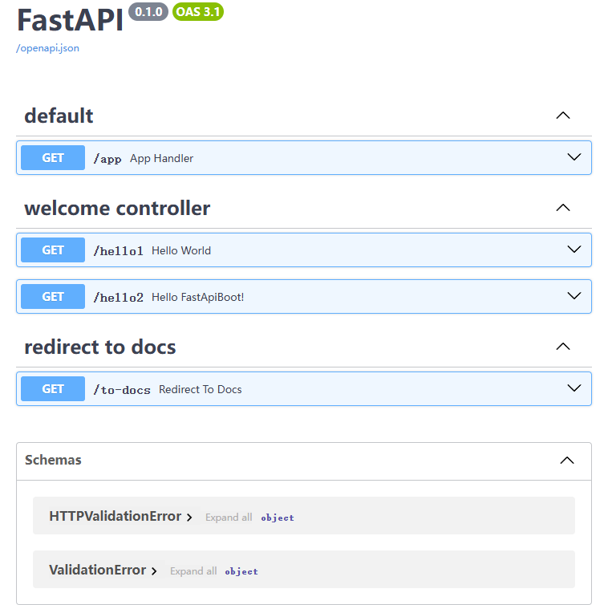

<div align='center'></div>
<div align='center'  class='title'></div>

# features

-   Starter for FastAPI project, faster and easier.

# Keywords:

-   class based view
-   auto scan and wired
-   public dependencies
-   ...

# Quick start

## 1. v1

```python
from fastapi import Query
from fastapi.responses import RedirectResponse
from fastapi_boot import Controller, RequestMapping, GetMapping, RequestMethod


@Controller
@RequestMapping("")
class WelcomeController:
    @RequestMapping(
        "/hello1",
        summary="Hello World",
        tags=["welcome controller"],
        methods=[RequestMethod.GET],
    )
    def hello_world1(self):
        return "Hello World!"

    @GetMapping("/hello2", summary="Hello FastApiBoot!", tags=["welcome controller"])
    def hello_world2(self, p: str = Query()):
        return dict(msg="Hello FastApiBoot!", query=p)


@Controller
@GetMapping("/to-docs", tags=["redirect to docs"])
def redirect_to_docs():
    return RedirectResponse("./docs")

```

```python
import os
from fastapi import FastAPI

from fastapi_boot import FastApiBootApplication

app = FastAPI()


@app.get("/app")
def app_handler():
    return True


@FastApiBootApplication(app)
def main():
    os.system("uvicorn application:app --reload")


if __name__ == "__main__":
    main()

```

<div align='center'></div>

## 2. v2

```python
from fastapi import Query
from fastapi.responses import RedirectResponse
from fastapi_boot import Controller, Get, Req


@Controller("", tags=["welcome controller"])
class WelcomeController:
    @Req("/hello1", summary="Hello World")
    def hello_world1():
        return "Hello World!"

    @Get("/hello2", summary="Hello FastApiBoot!")
    def hello_world2(self, p: str = Query()):
        return dict(msg="Hello FastApiBoot!", query=p)


@Controller("/to-docs").get("", tags=["redirect to docs"])
def redirect_to_docs():
    return RedirectResponse("./docs")

```

```python
from contextlib import asynccontextmanager
from fastapi import FastAPI
from fastapi_boot import FastApiBootApplication
import uvicorn


@asynccontextmanager
async def lifespan(app: FastAPI):
    FastApiBootApplication.run_app(app)
    yield


app = FastAPI(lifespan=lifespan)


@app.get("/app")
def app_handler():
    return True


if __name__ == "__main__":
    uvicorn.run("application:app", reload=True)

```

<div align='center'></div>
