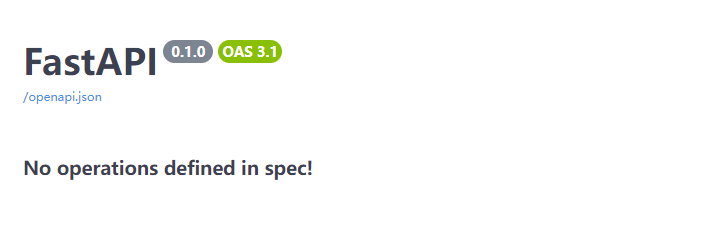
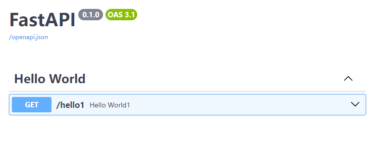
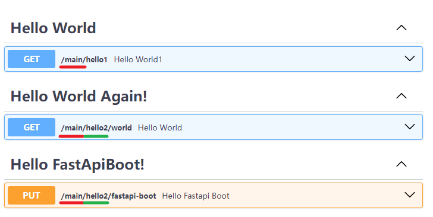
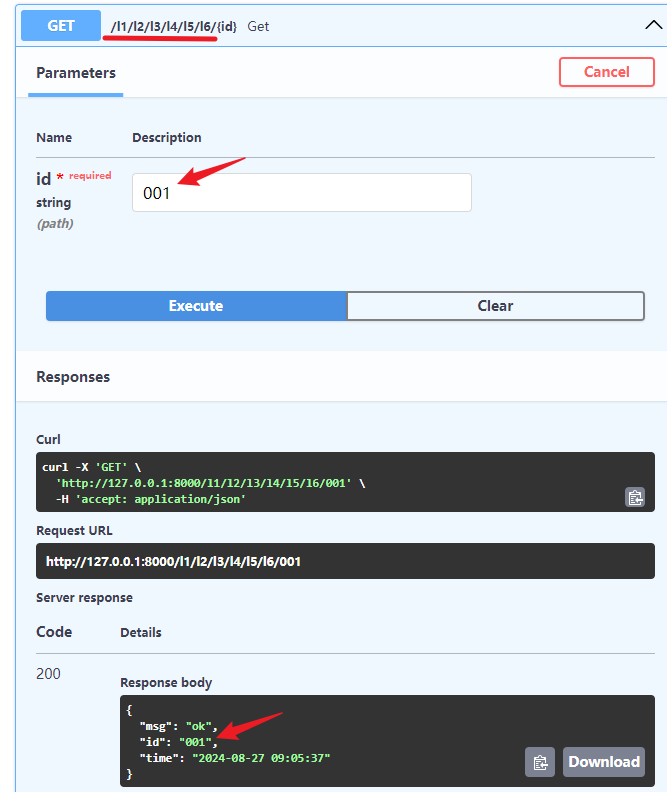
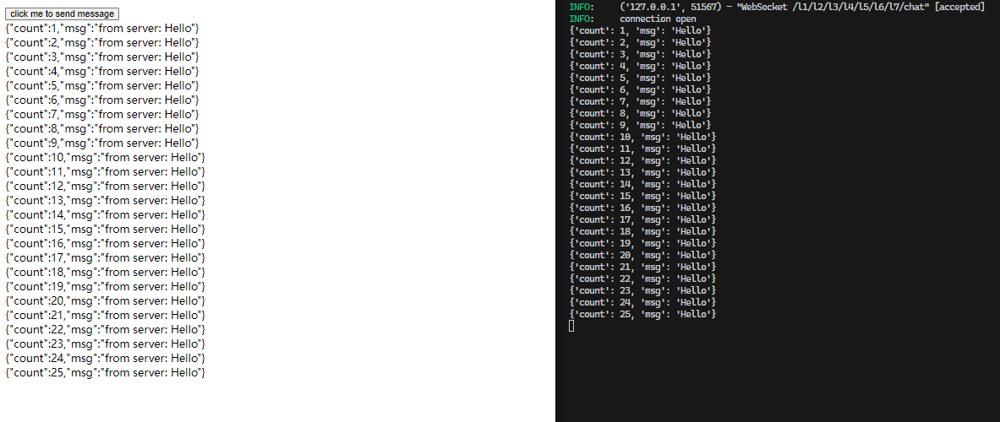
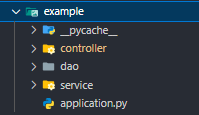
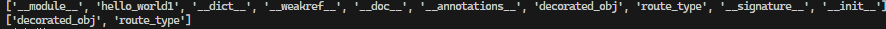
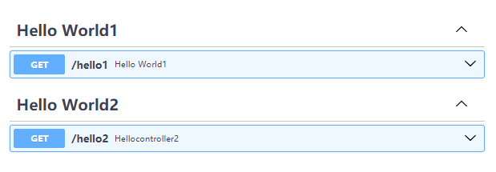

## 1. 控制器的作用

<style>
.red{
    color:red;
    font-weight:600;
}
.red-underline {
    text-decoration: underline red 5px;
}
.green-underline {
    text-decoration: underline green 5px;
}

</style>

- 路由状态枚举：

```python
class RouteStatus(Enum):
    """status of route
    - un_controlled, not been decorated by @Controller
    - deactivate, need `run` method in MainApplication
    - activate, can use
    """
    UN_CONTROLLED = 'un_controlled'
    DEACTIVATE = 'deactivate'
    ACTIVATE = 'activate'
```

::: tip

- 使控制器所在类下的所有路由从**失控** 转为 **受控**（**未激活**）；
- 激活属于另一个过程，这里不做讨论；

:::

::: details 举个例子

1. 失控状态，不会被注册

```python
@RequestMapping('/')
class WelcomeController:
    @RequestMapping('/hello1', tags=['Hello World'])
    def hello_world1():
        return 'Hello World!'
```



2. 受控

```python
@Controller # [!code ++]
@RequestMapping('/')
class WelcomeController:
    @RequestMapping('/hello1', tags=['Hello World'])
    def hello_world1():
        return 'Hello World!'
```



:::

## 2. 控制器的类型

- 路由类型枚举：

```python
class RouteType(Enum):
    """type of route
    - CBV: class_basic_view
    - FBV：function_basic_view
    - ENDPOINT：endpoint
    - INNER_CBV：inner_cbv
    """
    CBV = 'CBV'
    FBV = 'FBV'
    ENDPOINT = 'ENDPOINT'
    INNER_CBV = 'INNER_CBV'
```

- 其中控制器主要包括**类视图 CBV**、**函数视图 FBV**、**内部类视图 INNER_CBV**
- **ENDPOINT**是路由处理方法

### 1. CBV

- 前面的例子都属于类视图

&emsp;&emsp;**如果控制器上`RequestMapping(...)`只有一个属性`path`且为`''`时，可以省略`@RequestMapping(...)`**

```python
# http://localhost:8000/hello/hello2
@Controller
@RequestMapping('/hello')
class WelcomeController:
    @GetMapping('/hello2', tags=['Hello World'])
    def hello_world1():
        return 'Hello World!'

# http://localhost:8000/hello2
@Controller
class WelcomeController:
    @GetMapping('/hello2', tags=['Hello World'])
    def hello_world2():
        return 'Hello World!'
```

### 2. FBV

- 可以直接把函数作为控制器

```python{3}
# http://localhost:8000/hello
@Controller
@RequestMapping('/hello', tags=['Hello World'])
def hello_world1():
    return 'Hello World!'

# http://localhost:8000
@Controller
def hello_world2():
    return 'Hello World2!'
```

&emsp;&emsp;**嗯，看起来写单个接口时比类视图简单** <br/>
&emsp;&emsp;
但如果有条件获取 `FastAPI`和`APIRouter` 实例的话，为什么不用 `@app.get`、`@router.get`
呢？可能唯一的优点就是自动扫描无需引入吧:sweat_smile:

### 3. INNER_CBV

&emsp;&emsp;一种控制类嵌套的写法，建议不要嵌套太多；\
&emsp;&emsp;在控制器内部类上，只需写`@RequestMapping`，不需要`@Controller`，会把该内部类下的所有路由自动拼接到外部控制器类的路径后面，并受控激活注册；

```python{8,9}
@Controller
@RequestMapping('/main')
class HelloController:
    @RequestMapping('/hello1', tags=['Hello World'])
    def hello_world1():
        return 'Hello World!'

    @RequestMapping('/hello2')
    class HelloController2:
        @GetMapping('/world', tags=['Hello World Again!'])
        def hello_world():
            return 'Hello World Again!'

        @PutMapping('/fastapi-boot', tags=['Hello FastApiBoot!'])
        def hello_fastapi_boot(self, p: str = Query()):
            return dict(
                query=p,
                msg='Hello FastApiBoot!'
            )
```



- 其中<span class='red-underline'>红色下划线</span>的部分是`HelloController`的前缀，<span class='green-underline'>
  绿色下划线</span>的部分是`HelloController2`的前缀；

::: details 我有一个奇妙的想法 :smirk:

- 为了测试套娃能力，把多级路由按层级写开，而不是直接用`/l1/l2/l3/l4/l5/l6`

```python
import time
from fastapi import Path, WebSocket
from fastapi_boot import Controller, RequestMapping, GetMapping, WebSocketMapping


@Controller
@RequestMapping('l1')
class LevelController1:
    @RequestMapping('l2')
    class LevelController2:
        @RequestMapping('l3')
        class LevelController3:
            @RequestMapping('l4')
            class LevelController4:
                @RequestMapping('l5')
                class LevelController5:
                    @RequestMapping('l6')
                    class LevelController6:
                        @GetMapping('/{id}')
                        def get(self, id: str = Path()):
                            return dict(
                                msg='ok',
                                id=id,
                                time=time.strftime('%Y-%m-%d %H:%M:%S')
                            )

                        @RequestMapping('/l7')
                        class LevelController7:
                            @WebSocketMapping('/chat')
                            async def websocket(self, websocket: WebSocket):
                                await websocket.accept()
                                while True:
                                    data: dict = await websocket.receive_json()
                                    print(data)

                                    await websocket.send_json(dict(
                                        count=data.get('count', 1),
                                        msg='from server: ' +
                                        data.get('msg', '')
                                    ))
```



- **看起来效果还不错，我们再来测试下 websocket**：

```html
<!-- ... -->
<body>
    <button>click me to send message</button>
    <div></div>
</body>
<script>
    const btn = document.querySelector('button');
    const div = document.querySelector('div');
    let num = 1;
    const websocket = new WebSocket('ws://localhost:8000/l1/l2/l3/l4/l5/l6/l7/chat');
    websocket.onopen = () => {
        console.log('open');
    };
    websocket.onmessage = data => {
        div.innerText += `${ data.data }\n`;
    };
    btn.addEventListener('click', () => {
        websocket.send(
                JSON.stringify({
                    count: num++,
                    msg: 'Hello'
                })
        );
    });
</script>
```



**还可以:smiley:**

:::

## 3. 控制器补充

### 1. <span style='color:orange'>建议不要写在项目启动文件中</span>

::: warning 注意

```python
app = FastAPI()

@Controller # [!code --]
@RequestMapping('/main-test') # [!code --]
class MainTestController: # [!code --]
    @PostMapping('/t1') # [!code --]
    def post(self): # [!code --]
        return True # [!code --]

FastApiBootApplication.run_app(app)
```

- 扫描时会为每个控制器匹配唯一的`application`，写在项目启动之前，找不到对应的主应用；
- `FastApiBoot`会把找不到著应用的任务加入一个任务列表，等对应主应用初始化完成再执行；
- 建议**分包**写，每个包下有对应的`Controller`、`Service`、`Repository`等；



:::

### 2. 命名控制器

- 可以给`Controller`控制器加上名字，类似于其他组件，在需要**自动装配**多个相同类型的组件时很有用；
- 不论按类型装配或按名字装配都要求装配依据<span class='red'>唯一</span>，确保能正确装配唯一组件；
- 不过装配控制器的比较少见；

::: code-group

```python [/controller/hello_controller1.py]
# this controller can be autowired by name 'helloController1' or type HelloController
@Controller('helloController1')
@RequestMapping('/')
class HelloController1:
    @RequestMapping('/hello1', tags=['Hello World1'])
    def hello_world1():
        return 'Hello World1!'
```

```python [/controller/hello_controller2.py]
# this controller can only autowired by type HelloController2
@Controller
@RequestMapping('/hello2', tags=['Hello World2'])
def HelloController2():
    return 'Hello World2!'
```

```python [/example_test/test1.py]
from fastapi_boot import AutoWired

from controller.hello_controller1 import HelloController1
from controller.hello_controller2 import HelloController2


# will be autowired by name 'helloController1', the type HelloController1 will only user as the basis for the editor code prompt
hello_controller1 = AutoWired(HelloController1,'helloController1')

# will be autowired by type HelloController2
hello_controller2 = AutoWired(HelloController2)
print('\n',[i for i in hello_controller1.__dict__.keys()], '\n',[i for i in hello_controller2.__dict__.keys()])
```

> 其中的`decorated_obj`和`route_type`属于**FastApiBoot**在控制器上增加的属性，用于**获取信息**、**判断类型**等；

:::

**扫描输出**：
**Swagger UI：** 

### 3. 关于`self`

**作用**

1. 类的成员方法约定第一个参数是`self`；
2. 后面在获取获取路由信息、公共依赖的时候，`self`会 **非常有用**；

**能不写吗**

1. 能；
2. <span class='red'>最好写上</span>，不写不会报错（扫描时会判断是否写了`self`，进行不同处理），但编辑器的静态代码语法检查过不了；
3. **静态方法**和 FBV 没有为`self`预留位置，写了可能会出错；
