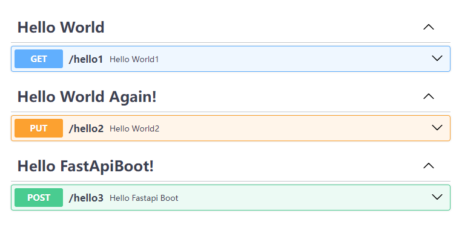
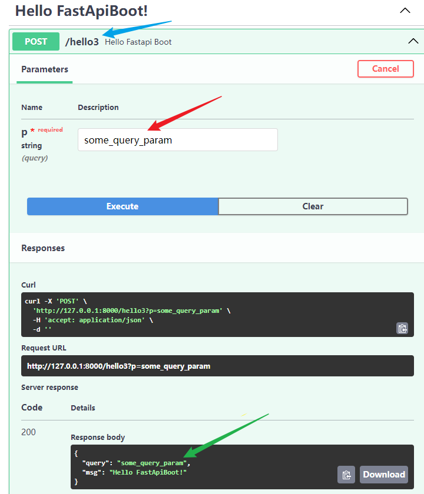

<b>按照惯例，先从 HelloWorld 开始：</b>

<style>
    .red{
        color:red;
        font-weight:600;
    }
    img{
        margin: 0 auto;
    }

</style>

## 1. 最普遍的 FastAPI 的写法

```python
from fastapi import FastAPI
import uvicorn

app = FastAPI()

# 1. 使用app.method_name添加
@app.get('/welcome1')
def hello_world():
    return dict(
        msg='success',
        data='Hello World!'
    )

# 2. 同时添加多个
@app.api_route('/welcome2', methods=['GET', 'POST'], tags=['Hello World'])
def hello_world1():
    return dict(
        msg='success',
        data='Hello World!'
    )

if __name__ == '__main__':
    uvicorn.run('app1:app', reload=True)
```

**其他运行方式**

::: code-group

```python [app1.py]
os.system('uvicorn app1:app --reload')
# or
os.system('fastapi dev app1.py')
```

```bash [cmd]
uvicorn app1:app --reload
# or
fastapi dev app1.py
```

:::


> 里面一些配置就不在后面写了，包括导包、运行服务器等；

## 2. 其他写法

```python
app = FastAPI()

# 1. 路由分发，注册子路由器 APIRouter 类
router = APIRouter()
@router.get('/welcome')
def hello_world():
    return dict(
        msg='success',
        data='Hello World!'
    )

app.include_router(router=router, prefix='')


def hello_world1():
    return JSONResponse(
        content=dict(
            msg='success',
            data='Hello World!'
        )
    )

# 2. 不使用装饰器
app.post('/welcome1')(hello_world1)
app.api_route('/welcome2', methods=['PUT'])(hello_world1)

# 3. 直接添加路由
app.add_api_route(path='/welcome3', endpoint=hello_world1)
# websocket对应add_api_websocket_route

# 4. 直接添加路由
route = APIRoute(path='/welcome4', endpoint=hello_world1)
app.routes.append(route)

# 5. app挂载
app = FastAPI()
app1= =FastAPI()
@app1.get('/welcome5')
def hello_world2():
    return dict(
        msg='success',
        data='Hello World!'
    )
app.mount('/app1',app1)
# app1中所有请求都会被加上前缀/app1
```

::: details :heavy_exclamation_mark: 提示

-   最好不要在同一个`.api_route`中映射多个方法

```python
@app.api_route('/test1',methods=['GET','POST','PUT'])
def f():...

@router.api_route('/test2',methods=['GET','POST','PUT'])
def f():...
```

1. 首先这不太符合常理，同时也会收到以下警告
   
2. 查看`openapi.json`，可以发现，生成**operationId**格式大概是`endpointName_path_method`，且三者重复，都是第一个`GET`
   
3. 源码中默认生成**operationId**的方法，取请求方法列表中第一个方法
   
   :::

## 3. FastApiBoot 中的写法

1.  `FastApiBoot` 中的路由映射写法类似于 `SpringMVC`，即通过 `Controller` 声明控制类（称之为`CBV`）；之后在扫描项目时会使 <span class="red">控制器下的所有路由</span> 从 **失控** 状态转为 **受控-未激活** 状态；
2.  在控制器中通过`RequestMapping`、`GetMapping`等装饰器装饰具体路由处理方法；

**只需以下两个步骤就可以完成本节的配置**

1. **控制器代码如下**

```python{3,5,6,8,12,16}
# WelcomeController.py
from fastapi import Query
from fastapi_boot import Controller, RequestMapping, GetMapping, PutMapping

@Controller
@RequestMapping('/')
class WelcomeController:
    @RequestMapping('/hello1', tags=['Hello World'])
    def hello_world1():
        return 'Hello World!'

    @PutMapping('/hello2', tags=['Hello World Again!'])
    def hello_world2():
        return 'Hello World Again!'

    @PostMapping('/hello3', tags=['Hello FastApiBoot!'])
    def hello_fastapi_boot(self, p: str = Query()):
        return dict(
            query=p,
            msg='Hello FastApiBoot!'
        )

```

2. **配置启动文件**

&emsp; :ballot_box_with_check: <b>只需引入启动类，无需引入控制器；</b><br/>
&emsp; :white_check_mark: `FastApiBoot` 会 <span class='red'>自动递归扫描</span> 启动文件所在路径下所有的`.py`文件，并 <span class='red'>自动加载</span> 扫描到的控制器、自动受控，完成激活、注册；<br/>
&emsp; :x: 注意项目下的包名不要和一些 py 包名重复（如`test`），可能会扫描失败；

```python{5,8}
# app1.py
from fastapi import FastAPI
import uvicorn

from fastapi_boot import FastApiBootApplication

app = FastAPI()
FastApiBootApplication.run_app(app)

def main():
    uvicorn.run('app1:app', reload=True)


if __name__ == '__main__':
    main()
```

**项目（额，暂且先叫个项目吧）结构如下：**


**好了现在运行一下 app1.py，控制台输出如下：**


**FastAPI Swagger UI：**



**随便请求个接口：**



嗯，:smiley:**看起来效果还不错**，应该大概也许可能说不定能够胜任简单的 API 开发了。具体高亮那些行有什么用法、底部做了什么处理，且听后面慢慢分解。
