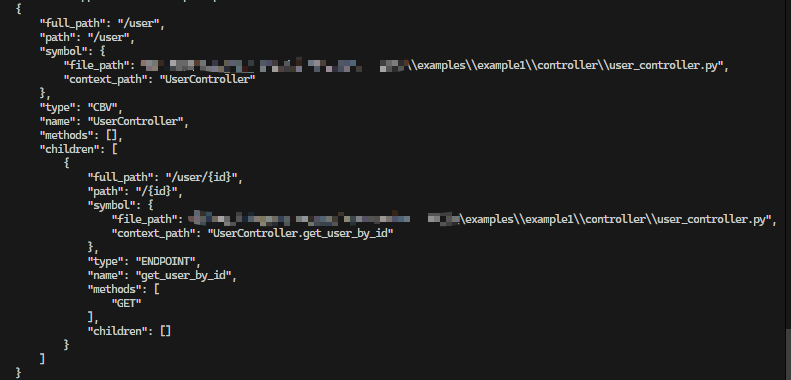

**这节介绍几个（比较寒碜，就俩）有用的工具**

-   首先了解一下`hooks`，意为钩、钩住；<br/>
-   作用：把有关路由的信息**钩**到**类的静态变量中**，然后其下所有<b>`ENDPOINT`</b>都可以使用获取到的数据；

::: tip 原理

-   充当一个**占位符**的作用，扫描/运行时根据占位符不同，把需要的数据钩出来，重新赋值；

:::

## 1. `useRoute`

&emsp;&emsp;**获取当前类的路由信息，等于从`application.routes_layer`中导出该类对应的路由层级信息**

上一节的例子

```python{3,13,17}
import json
from fastapi import Path
from fastapi_boot import Controller, RequestMapping, GetMapping, AutoWired, useRoute

from bean.user_beans import User
from service.user_service import UserService


@Controller
@RequestMapping('/user')
class UserController:
    user_service = AutoWired(UserService)
    route = useRoute()

    @GetMapping('/{id}', tags=['get user by id'], response_model=User)
    def get_user_by_id(self, id: int = Path(...)):
        print(json.dumps(self.route.dict(), indent=4, ensure_ascii=False))
        return self.user_service.get_user_by_id(id)

```

`Route`的类型如下：

```python
class RouteLayerItem(BaseModel):
    full_path: Annotated[str, Field(description='current full path')]
    path: Annotated[str, Field(description='path')] = ''
    symbol: Annotated[Symbol, Field(
        description="route's id ")]
    type: Annotated[RouteTypeLiteral,
                    Field(description='route type')]
    name: Annotated[str, Field(description='name')]
    methods: Annotated[List[str], Field(description='request methods')]
    children: Annotated[List['RouteLayerItem'],
                        Field(description='sub-route')] = []
```

输出结果如下：

## 2. `useDeps`

&emsp;&emsp;**提取所在类下所有`ENDPOINT`的公共依赖**<br/>
&emsp;&emsp;**`INNER_CBV`中的`ENDPOINT`获取不到父类的公共依赖，需要为它自己重新声明**

```python{17,34,38,41,52,54,57}
import logging
import time
from fastapi import Depends, HTTPException, Path, Request
from fastapi_boot import Controller, RequestMapping, GetMapping, AutoWired, useRoute, DeleteMapping, useDeps


from service.user_service import UserService


file_handler = logging.FileHandler('user_controller.log')
file_handler.setLevel(logging.DEBUG)
file_handler.setFormatter(logging.Formatter('%(asctime)s - %(name)s - %(levelname)s - %(message)s'))
logger = logging.getLogger('user_controller')
logger.addHandler(file_handler)


def verify_user(request: Request, id: str = Path(...)):
    token = request.headers.get('Authorization', '')
    # verify user
    # ...
    user_agent = request.headers.get('userAgent', '')
    origin = request.headers.get('origin','')
    logger.info(
        f'user {id}, time = {time.strftime("%Y-%m-%d %H:%M:%S")}, user_agent = {user_agent}, origin = {origin}')
    # fake result
    return True, id


@Controller
@RequestMapping('/user')
class UserController:
    user_service = AutoWired(UserService)
    route = useRoute()
    has_permission = useDeps(verify_user)

    @GetMapping('/{id}')
    def get_user_by_id(self):
        if self.has_permission[0]:
            # invoke some service method...
            return dict(
                id=self.has_permission[1],
                operation='get',
                msg='success'
            )
        else:
            raise HTTPException(
                status_code=401,
                detail='no permission',
            )

    @DeleteMapping('/{id}')
    def delete_user_by_id(self, id: str = Path()):
        # can also get id here ↗
        if self.has_permission[0]:
            # invoke some service method...
            return dict(
                id=id,
                operation='delete',
                msg='success'
            )
        else:
            raise HTTPException(
                status_code=401,
                detail='no permission',
            )

```
