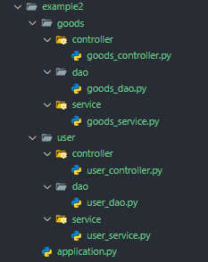

## 1. 项目启动

<style>
img{
    margin: 0 auto;
}

</style>

**有多种项目启动方式，可以根据自己的需求选择**

项目结构：


**配置类说明**

```python
from typing import Annotated, Union
from pydantic import BaseModel, Field

class Config:
    need_pure_api: Annotated[bool, Field(description='是否删除自带的api')] = False
    scan_timeout_second: Annotated[Union[int, float], Field(gt=0,
                                                            description='扫描超时时间，超时未找到组件会报错')] = 10
```

### 1. 只运行项目

> staticmethod

```python{12}
import os
from fastapi import FastAPI
from fastapi_boot import FastApiBootApplication, Config

app = FastAPI()
# config of project
config = Config(
    need_pure_api=True,
    scan_timeout_second=20
)

FastApiBootApplication.run_app(app, config)

def main():
    os.system('fastapi dev application.py')

if __name__ == '__main__':
    main()
```

> instance decorator

```python{1}
@FastApiBootApplication(app, config)
def main():
    os.system('fastapi dev application.py')

if __name__ == '__main__':
    main()
```

### 2. 输出项目路由信息

**项目路由信息类型**

|                属性                |                                           类型                                           |        描述        |
| :--------------------------------: | :--------------------------------------------------------------------------------------: | :----------------: |
|      `simple_routes_records`       |                 `List[SimpleRouteRecordItem]`                   |    简单路由记录    |
| `serialized_simple_routes_records` |                               ↑，`Dict` 序列化简单路由记录                               |
|          `routes_records`          | `List[RouteRecordItem extends SimpleRoutesRecords]`，多两个字段 |    完整路由记录    |
|          `routes_layers`           |                     `List[RouteLayerItem]`                      |    路由层级记录    |
|     `serialized_routes_layers`     |                                        ↑, `Dict`                                         | 序列化路由层级记录 |

> run instance

```python{1,2}
application = FastApiBootApplication(app, config)
application.run()

def main():
    with open('./simple_route_record.json', 'w', encoding='utf8') as f:
        json.dump(application.serialized_simple_routes_records,
                  f, indent=4, ensure_ascii=False)
    with open('./route_layer.json', 'w', encoding='utf8') as f:
        json.dump(application.routes_layers,
                  f, indent=4, ensure_ascii=False)
    os.system('fastapi dev application.py')
```

> instance decorator

```python{1,3}
application = FastApiBootApplication(app, config)

@application
def main():
    with open('./simple_route_record.json', 'w', encoding='utf8') as f:
        json.dump(application.serialized_simple_routes_records,
                  f, indent=4, ensure_ascii=False)
    with open('./route_layer.json', 'w', encoding='utf8') as f:
        json.dump(application.serialized_routes_layers,
                  f, indent=4, ensure_ascii=False)
    os.system('fastapi dev application.py')
```

**输出 json 例子**

::: code-group

```json [simple_route_record.json]
[
    {
        "symbol": {
            "file_path": "xxx\\examples\\example1\\controller\\hello_controller1.py",
            "context_path": "HelloController1.hello_world1"
        },
        "path": "/hello1",
        "methods": ["GET"],
        "endpoint_name": "hello_world1",
        "route_status": "activate"
    },
    {
        "symbol": {
            "file_path": "xxx\\examples\\example1\\controller\\hello_controller2.py",
            "context_path": "HelloController2"
        },
        "path": "/hello2",
        "methods": ["GET"],
        "endpoint_name": "HelloController2",
        "route_status": "activate"
    }
]
```

```json [route_layer.json]
[
    {
        "full_path": "",
        "path": "",
        "symbol": {
            "file_path": "xxx\\examples\\example1\\controller\\hello_controller1.py",
            "context_path": "HelloController1"
        },
        "type": "CBV",
        "name": "HelloController1",
        "methods": [],
        "children": [
            {
                "full_path": "/hello1",
                "path": "/hello1",
                "symbol": {
                    "file_path": "xxx\\examples\\example1\\controller\\hello_controller1.py",
                    "context_path": "HelloController1.hello_world1"
                },
                "type": "ENDPOINT",
                "name": "hello_world1",
                "methods": ["GET"],
                "children": []
            }
        ]
    },
    {
        "full_path": "/hello2",
        "path": "/hello2",
        "symbol": {
            "file_path": "xxx\\examples\\example1\\controller\\hello_controller2.py",
            "context_path": "HelloController2"
        },
        "type": "CBV",
        "name": "HelloController2",
        "methods": ["GET"],
        "children": []
    }
]
```

:::

## 2. 项目挂载

**首先来看一下几种项目组织方式**

> 1. 相同类型的组件放在一起，例如`controller`、`service`、`dao`等


> 2. 功能耦合的组件放在一起，例如**用户模块**、**商品模块**、**聊天模块**等



**在 2 的基础上，使用<a href='https://fastapi.tiangolo.com/advanced/sub-applications/' target='_blank'>`FastAPI` 的挂载功能</a>，进一步拆分为子项目，分别作为独立的子应用**

::: tip

-   `FastApiBoot` 只是对每个 `FastAPI` 实例添加了路由，并没有改变所有原有的 api；
-   这里的挂载是`FastAPI`之间的功能；

:::

> 项目结构如下


**每个子应用之间相互独立，并且都有自己的启动文件，控制器中各写了一个 getById 的方法**

::: code-group

```python [application.py]{3,4,8,9}
from fastapi import FastAPI
import uvicorn
from goods_app.application import app as goods_app
from user_app.application import app as user_app

app = FastAPI()

app.mount('/goods', goods_app)
app.mount('/user', user_app)

def main():
    uvicorn.run('application:app', reload=True)

if __name__ == '__main__':
    main()
```

```python [/goods_app/application.py]
from fastapi import FastAPI
from fastapi_boot import FastApiBootApplication


app = FastAPI()
# You can create an instance of FastApiBootApplication to get some information about the sub-project.
FastApiBootApplication.run_app(app)
```

```python [/user_app/application.py]
from fastapi import FastAPI
from fastapi_boot import FastApiBootApplication


app = FastAPI()
FastApiBootApplication.run_app(app)
```

:::

两个子应用的 docs 如下：


