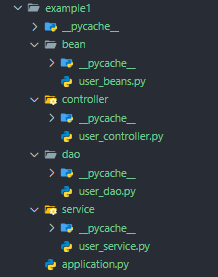
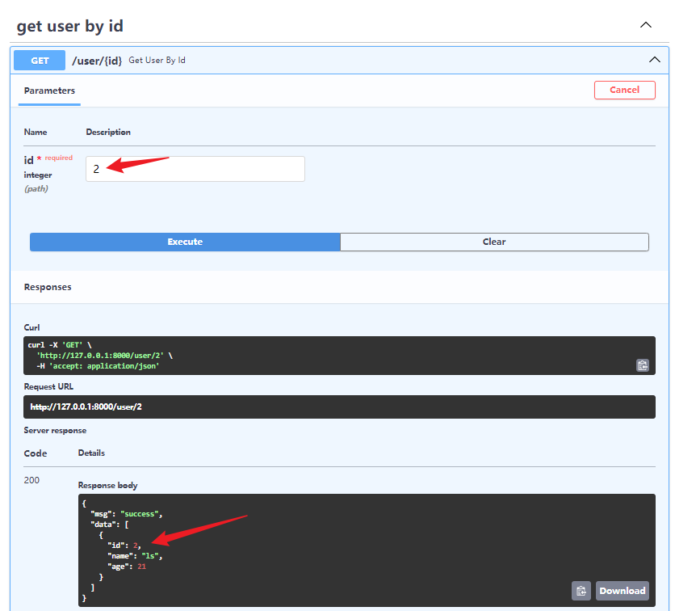

**之前讨论了项目启动和挂载，这节是项目内部结构**

<style>
.important{
    font-weight:900;
}
.red{
        color:red;
        font-weight:600;
    }
img{
    margin: 0 auto;
}

</style>

关键词：<span class='important'>`组件`、`控制反转`、`自动装配`</span>

1. **组件**：项目中被 controller、service、repository、component、bean 装饰的类等；
2. **控制反转**：`IOC`(`Inversion Of Control`)，`FastApiBoot`通过固定的装饰器收集组件，进行管理和实例化，而不需要使用者手动实例化；
3. **自动装配**：在需要使用组件的地方，传入组件类型（或组件类型 + 组件名），从自动`FastApiBoot`容器中查找并进行装配；

## 1. 组件的类型

各组件类型枚举类如下：

```python
class BeanType(Enum):
    BEAN = 'Bean'
    COMPONENT = 'Component'
    CONTROLLER = 'Controller'
    SERVICE = 'Service'
    REPOSITORY = 'Repository'
```

含义如下：
|组件类型|含义|
|:--:|:--:|
|`Bean`|定制实例进行装配，普通组件|
|`Component`|普通组件|
|`Controller`|控制层|
|`Service`|服务层|
|`Repository`|数据层|

## 2. 组件的收集

1. 在创建`FastApiBoot`实例时，会递归扫描启动文件所在目录下所有.py 文件，将所有在**模块加载时能识别的**、被以上装饰器装饰的组件收集到容器中；
2. `Bean`定义写在模块顶层、作为模块中类（可以嵌套）的成员等都会被正确收集，但<span class='red'>
   定义在函数中会被忽略，早扫描导入包时并不会运行那些函数</span>；
    1. `Bean`只能装饰函数且必须**显式指定返回值类型**，不然不知道它是啥类型；
3. 其他组件**限制必须写在模块顶层**；
4. `Bean`收集的是函数返回的实例，而其他装饰器收集的是类（需要进行实例化再装配）；

::: code-group

```python [Bean]
from fastapi_boot import Bean

class User:
    def __init__(self, name, age):
        self.name = name
        self.age = age

# ok
@Bean('user1')
def get_user1() -> User:
    return User('zs', 20)

def foo():
    # ignore
    @Bean('user2')
    def get_user2() -> User:
        return User('ls', 21)

class C:
    class D:
        # ok
        @Bean('user3')
        def get_user1() -> User:
            return User('ww', 22)
```

```python [others]
# Component、Repository、Controller are similar to Service
from fastapi_boot import Service

# ok
@Service
class UserService:
    ...


def foo():
    # error
    @Service
    class GoodsService:
        ...
    return GoodsService


class C:
    class D:
        # error
        @Service
        class OrderService:
            ...
```

:::

## 3. 组件的自动装配

### 1. 概述

&emsp;&emsp;`FastApiBoot`会为每个`FastApiBootApplication`的每种组件维护一个列表，在需要时会从中查找所需组件并**自动**
完成赋值装配；<br/>
&emsp;&emsp;通过`AutoWired`函数来实现**自动装配**（py 的装饰器只能装饰类或函数，考虑了 set
方法、构造器等，最后还是选择不用装饰器，直接包在变量外面:eyes:）；

### 2. 例子

**然后通过一个例子来看看用法**<br/>
项目结构如下：

- 首先定义用户类

::: code-group

```python{1,,17,18,,22,23,27,28,32,33} [/bean/user_beans.py]
from fastapi_boot import Bean
from pydantic import BaseModel


class User(BaseModel):
    id: int
    name: str
    age: int

    def play(self):
        print(f'{self.name} is playing.')

    def increment_age(self):
        self.age += 1


@Bean('user1')
def get_user1() -> User:
    return User(id=1, name='zs', age=20)


@Bean('user2')
def get_user2() -> User:
    return User(id=2, name='ls', age=21)


@Bean('user3')
def get_user3() -> User:
    return User(id=3, name='ww', age=22)


@Bean('user4')
def get_user4() -> User:
    return User(id=4, name='zl', age=23)

```

:::

- 再写 Dao 层

::: code-group

```python{2,7,10-13} [/dao/user_dao.py]
from typing import List
from fastapi_boot import Repository, AutoWired

from bean.user_beans import User


@Repository
class UserDao:
    users: List[User] = [
        AutoWired(User, 'user1'),
        AutoWired(User, 'user2'),
        AutoWired(User, 'user3'),
        AutoWired(User, 'user4')
    ]

    def get_user_by_id(self, id: int) -> List[User]:
        return [i for i in self.users if i.id == id]

```

:::

- 之后是 Service 层

::: code-group

```python{2,5,8} [/service/user_service.py]
from fastapi.responses import JSONResponse
from fastapi_boot import Service, AutoWired
from dao.user_dao import UserDao

user_dao = AutoWired(UserDao)


@Service('user_service1')
class UserService:
    def get_user_by_id(self, id: int) -> JSONResponse:
        return JSONResponse(
            content=dict(
                msg='success',
                data=[i.dict() for i in user_dao.get_user_by_id(id)]
            )
        )

```

:::

- 最后是 Controller 层

::: code-group

```python{2,8,11} [/controller/user_controller.py]
from fastapi import Path
from fastapi_boot import Controller, RequestMapping, GetMapping, AutoWired

from bean.user_beans import User
from service.user_service import UserService


@Controller
@RequestMapping('/user')
class UserController:
    user_service = AutoWired(UserService, 'user_service1')

    @GetMapping('/{id}', tags=['get user by id'], response_model=User)
    def get_user_by_id(self, id: int = Path(...)):
        return self.user_service.get_user_by_id(id)

```

:::

**看下结果**


嗯，看起来确实还行:astonished:

### 3. 过程梳理

**接下来梳理一下**

1. 首先向容器注入了 4 个 `Bean`，参数字符串表示**Bean名**
    1. 不写名只能按类型装配，但遇到 4 个 User 的情况，找不到装配哪个，就会失败；
    2. 写 Bean 名可以**按照类型或名称装配**；
2. UserDao 中的静态变量`users`自动装配了 4 个 User，可以使用`self`或`UserDao`获取；
3. UserService 中在模块顶层按照类型装配了 UserDao，并在获取用户时调用；
4. UserController 将 UserService 自动装配为静态变量，处理请求时调用；

### 4. 装配总结

&emsp;1. &emsp;在扫描过程中遇到 AutoWired 时 会不断检查是否扫描到了所需的组件，找到了则返回，超时（**默认 10s**
）没找到会报错，可以在`FastApiBootApplication`初始化或静态调用时传入`Config`配置类实例来设置超时时间；<br/>
&emsp;2. &emsp;可以根据**类型**`AutoWired(User)`或**名字**`AutoWired(User, 'user1')`
进行装配，用名字装配时类型只起到给编辑器代码提示的作用；<br/>
&emsp;3. &emsp;选择在扫描时进行装配（即装配到<span class='red'>模块顶层变量</span>、<span class='red'>类变量</span>
上），而不是运行时（比如**请求时才调用的函数内部**），减少请求处理时装配的时间消耗；

**祝贺:star:，现在你已经看完了`FastApiBoot`最核心的部分了**
