<style>
    .red{
        color:red;
        font-weight:800;
    }

</style>

## 1. 写法一览

**先看一个例子**

```python{1,8,15,21,24}
from contextlib import asynccontextmanager
from fastapi import FastAPI
from fastapi.responses import RedirectResponse
from fastapi_boot import FastApiBootApplication, Controller, Get
import uvicorn


@Controller("/to-doc", tags=["to doc controller"])
class MainController:
    @Get("", summary="to doc func")
    def to_docs(self):
        return RedirectResponse("/docs")


@asynccontextmanager
async def lifespan(app: FastAPI):
    FastApiBootApplication.run_app(app)
    yield


app = FastAPI(lifespan=lifespan)


@Controller("/foo", tags=["foo controller"]).post("/foo1", summary="foo1")
def hello_fastapi_boot():
    return "hello fastapi_boot"


def main():
    uvicorn.run("application:app", reload=True)


if __name__ == "__main__":
    main()

```

**看下效果**
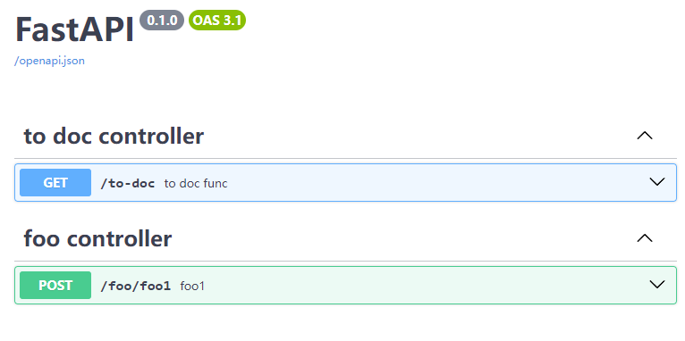 <hr/>
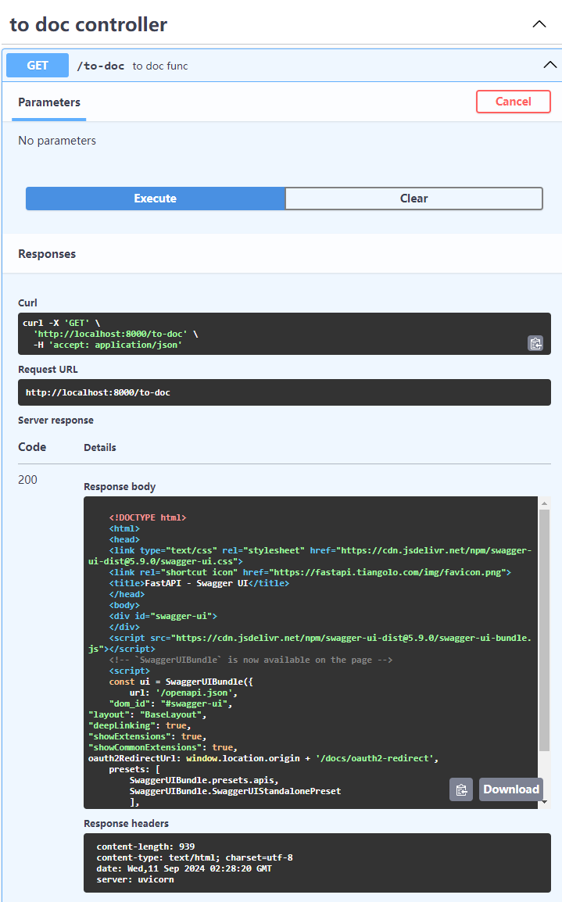 <hr/>
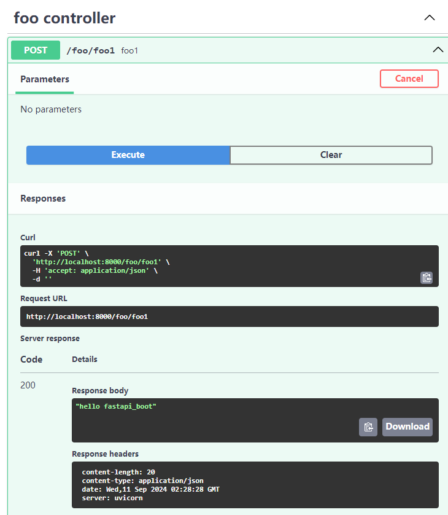

:cat:还不错

:white_check_mark:几点说明：

1. 这里使用了`asynccontextmanager`进行初始化和扫描，也可以把数据库初始化等操作放在里面；
2. 控制器、组件都可以写在启动文件中，包括启动之前和之后，建议还是<b><span class='red'>另起文件</span></b>写；但`AutoWired`不能写在项目启动前；
3. 控制器本质上是个`APIRouter`，其下只有一个路由时可以用 24 行的写法；

## 2. 项目启动

**（1）现在 FastApiBoot 实例不会暴露任何有关路由的信息，只起个启动的作用** <br/>
现在可以：

:::code-group

```python[run instance lifespan]
@asynccontextmanager
async def lifespan(app: FastAPI):
    FastApiBootApplication(app).run()
    yield

app = FastAPI(lifespan=lifespan)
```

```python[staticmethod lifespan]
@asynccontextmanager
async def lifespan(app: FastAPI):
    FastApiBootApplication.run_app(app)
    yield

app = FastAPI(lifespan=lifespan)
```

```python[run instance]
app = FastAPI()
FastApiBootApplication(app).run()
```

```python[staticmethod]
app = FastAPI()
FastApiBootApplication.run_app(app)
```

:::

**（2）配置**

```python
class Config(BaseModel):
    need_pure_api: Annotated[bool, Field(description="是否删除自带的api")] = False
    scan_timeout_second: Annotated[
        Union[int, float], Field(gt=0, description="扫描超时时间，超时未找到报错")
    ] = 10
    exclude_scan_path:Annotated[List[str],Field(description='忽略扫描的模块或包在项目中的路径，以.分隔')]=[]
```

项目结构如下：
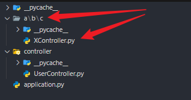

::: code-group

```python{20,24}[application.py]
from contextlib import asynccontextmanager
from fastapi import FastAPI
from fastapi.responses import RedirectResponse
from fastapi_boot import FastApiBootApplication, Controller, Get, Config
import uvicorn


@Controller("/to-doc", tags=["to doc controller"])
class MainController:
    @Get("", summary="to doc func")
    def to_docs(self):
        return RedirectResponse("/docs")


@Controller("/foo", tags=["foo controller"]).post("/foo1", summary="foo1")
def hello_fastapi_boot():
    return 1


config = Config(exclude_scan_path=["a.b"])

app = FastAPI()

FastApiBootApplication.run_app(app, config)


def main():
    uvicorn.run("application:app", reload=True)


if __name__ == "__main__":
    main()

```

```python[XController.py]
from fastapi_boot import Controller


@Controller("/testX").get("")
def f():
    return "x"

```

```python[UserController.py]
# None
```

:::

-   那么现在就不会扫描 a.b 下的所有模块（包括包中的模块），
-   默认启动文件不会扫描
    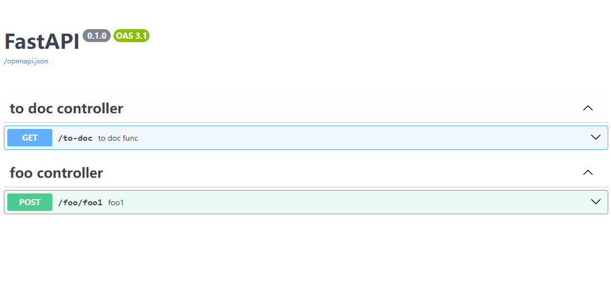

## 3. 挂载

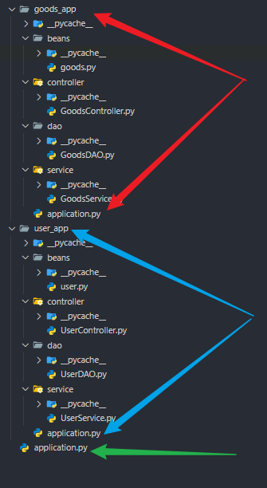

> 1. goods_app

::: code-group

```python[goods.py]
from pydantic import BaseModel
from fastapi_boot import Bean


class Goods(BaseModel):
    name: str
    price: float
    num: int


@Bean("computer")
def get_computer() -> Goods:
    return Goods(name="computer", price=9999, num=100)


@Bean("mobile")
def get_mobile() -> Goods:
    return Goods(name="mobile", price=7777, num=200)


@Bean("car")
def get_car() -> Goods:
    return Goods(name="car", price=200000, num=30)

```

```python[GoodsDAO.py]
from typing import List
from fastapi_boot import Repository, AutoWired

from goods_app.beans.goods import Goods


@Repository
class GoodsDAO:
    goods_list = [
        AutoWired(Goods, "computer"),
        AutoWired(Goods, "mobile"),
        AutoWired(Goods, "car"),
    ]

    def list(self) -> List[Goods]:
        return self.goods_list

```

```python[GoodsService.py]
from typing import List
from fastapi_boot import Service, AutoWired

from goods_app.dao.GoodsDAO import Goods, GoodsDAO


@Service
class GoodsService:
    goods_dao = AutoWired(GoodsDAO)

    def list(self) -> List[Goods]:
        return self.goods_dao.list()

```

```python[GoodsController.py]
from typing import List
from fastapi_boot import Controller, AutoWired, Get

from goods_app.beans.goods import Goods
from goods_app.service.GoodsService import GoodsService


@Controller("", tags=["goods controller"])
class GoodsController:
    goods_service = AutoWired(GoodsService)

    @Get("/list", summary="list all goods")
    def list(self) -> List[Goods]:
        return self.goods_service.list()

```

```python[application.py]
from fastapi import FastAPI
from fastapi_boot import FastApiBootApplication

app = FastAPI()
FastApiBootApplication.run_app(app)

```

:::

> 2. user_app

::: code-group

```python[user.py]
from pydantic import BaseModel
from fastapi_boot import Bean


class User(BaseModel):
    name: str
    age: int


@Bean("computer")
def get_computer() -> User:
    return User(name="zhangsan", age=20)


@Bean("mobile")
def get_mobile() -> User:
    return User(name="lsi", age=21)


@Bean("car")
def get_car() -> User:
    return User(name="wangwu", age=22)

```

```python[UserDAO.py]
from typing import List
from fastapi_boot import Repository, AutoWired

from user_app.beans.user import User


@Repository
class UserDAO:
    user_list = [
        AutoWired(User, "computer"),
        AutoWired(User, "mobile"),
        AutoWired(User, "car"),
    ]

    def list(self) -> List[User]:
        return self.user_list

```

```python[UserService.py]
from typing import List
from fastapi_boot import Service, AutoWired

from user_app.dao.UserDAO import User, UserDAO


@Service
class UserService:
    user_dao = AutoWired(UserDAO)

    def list(self) -> List[User]:
        return self.user_dao.list()

```

```python[UserController.py]
from typing import List
from fastapi_boot import Controller, AutoWired, Get

from user_app.beans.user import User
from user_app.service.UserService import UserService


@Controller("/", tags=["user controller"])
class UserController:
    user_service = AutoWired(UserService)

    @Get("/list", summary="get all user")
    def list(self) -> List[User]:
        return self.user_service.list()

```

```python[application.py]
from fastapi import FastAPI
from fastapi_boot import FastApiBootApplication

app = FastAPI()
FastApiBootApplication.run_app(app)

```

:::

> 3. 挂载

::: code-group [application.py]

```python
from contextlib import asynccontextmanager
from fastapi import FastAPI
import uvicorn
from goods_app.application import app as goods_app
from user_app.application import app as user_app


app = FastAPI()
app.mount("/goods", goods_app)
app.mount("/user", user_app)

if __name__ == "__main__":
    uvicorn.run("application:app", reload=True)

```

:::

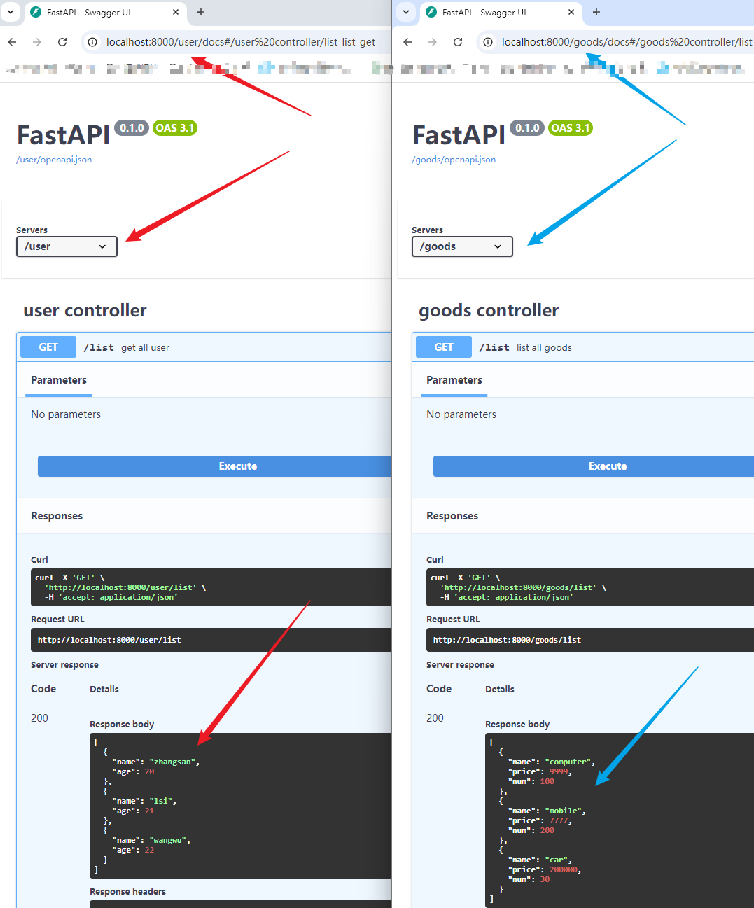

## 4. 控制器搭配 hook 写法

**修改之前的 goods_app 模块**

```python
from typing import List
from fastapi_boot import Repository, AutoWired

from goods_app.beans.goods import Goods


@Repository
class GoodsDAO:
    goods_list = [
        AutoWired(Goods, "computer"),
        AutoWired(Goods, "mobile"),
        AutoWired(Goods, "car"),
    ]

    def list(self) -> List[Goods]:
        return self.goods_list

    def get_by_name(self, name: str) -> List[Goods]:
        return [i for i in self.goods_list if i.name == name]

    def delete_by_name(self, name: str) -> int:
        ori_num = len(self.goods_list)
        self.goods_list = [i for i in self.goods_list if i.name != name]
        return ori_num - len(self.goods_list)

```

```python
from typing import List
from fastapi_boot import Service, AutoWired

from goods_app.dao.GoodsDAO import Goods, GoodsDAO


@Service
class GoodsService:
    goods_dao = AutoWired(GoodsDAO)

    def list(self) -> List[Goods]:
        return self.goods_dao.list()

    def get_by_name(self, name: str) -> List[Goods]:
        return self.goods_dao.get_by_name(name)

    def delete_by_name(self, name: str) -> int:
        return self.goods_dao.delete_by_name(name)

```

```python{44,45,62,64,68}
from typing import List
from fastapi import HTTPException, Path, Request
from fastapi.responses import JSONResponse
from fastapi_boot import (
    Controller,
    AutoWired,
    Get,
    Delete,
    Post,
    Prefix,
    Req,
    RequestMethod,
    useDep,
    useRoutes,
    useRouter,
)

from goods_app.beans.goods import Goods
from goods_app.service.GoodsService import GoodsService

white_list = ["abc", "xyz", "ijk"]


def verify_token(request: Request) -> bool:
    token = request.headers.get("Authorization", "")
    # do something to verify token
    # fake result
    return token in white_list


goods_service = AutoWired(GoodsService)


@Controller("", tags=["goods controller"])
class GoodsController:

    @Get("/list", summary="list all goods")
    def list(self) -> List[Goods]:
        return goods_service.list()

    # 1.
    @Prefix("/public-prefix")
    class Foo:
        routes = useRoutes()
        router = useRouter()

        @Req(methods=[RequestMethod.GET])
        def foo(self):
            print(self.router)
            return "foo"

        @Post()
        def bar(self):
            print(self.routes)
            return "bar"

    @Get("{name}", summary="get goods by name")
    def get_goods_by_name(self, name: str = Path()):
        return goods_service.get_by_name(name)

    # 2.
    @Prefix(prefix="", tags=["must get permission first"])
    class GoodsPermissionController:
        has_access = useDep(verify_token)

        @Delete("{name}", summary="delete goods by name")
        def delete_by_name(self, name: str = Path()):
            if not self.has_access:
                raise HTTPException(status_code=401, detail="has no permission")
            return JSONResponse(
                content=dict(
                    msg="delete success", data=goods_service.delete_by_name(name)
                )
            )

```

说明：

1. 在`Prefix`装饰类的内部，外部类的 hooks 都无法使用，可以利用这点**将需要/不需要权限但路径差别不大的路由分开**；
2. 同样，`Prefix`内部的 hooks 也无法影响更内部的`Prefix`；
3. `useRoutes`获取当前类下的所有路由；
   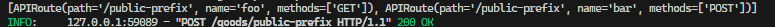
4. `useRouter`获取当前所在控制器；
   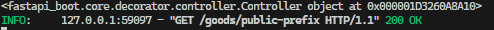

删除示例：
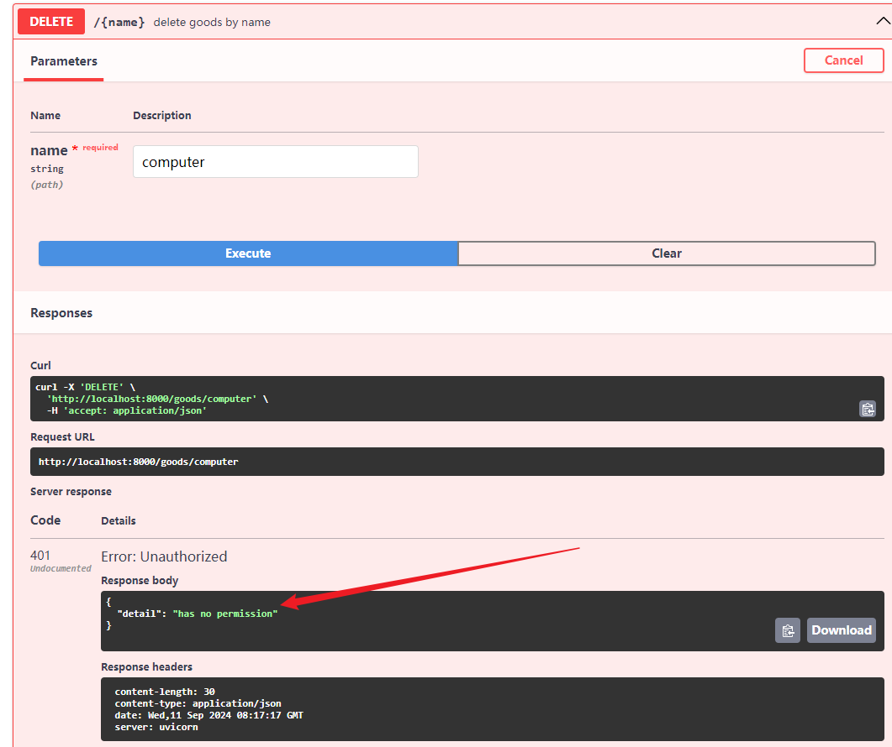 <br/>
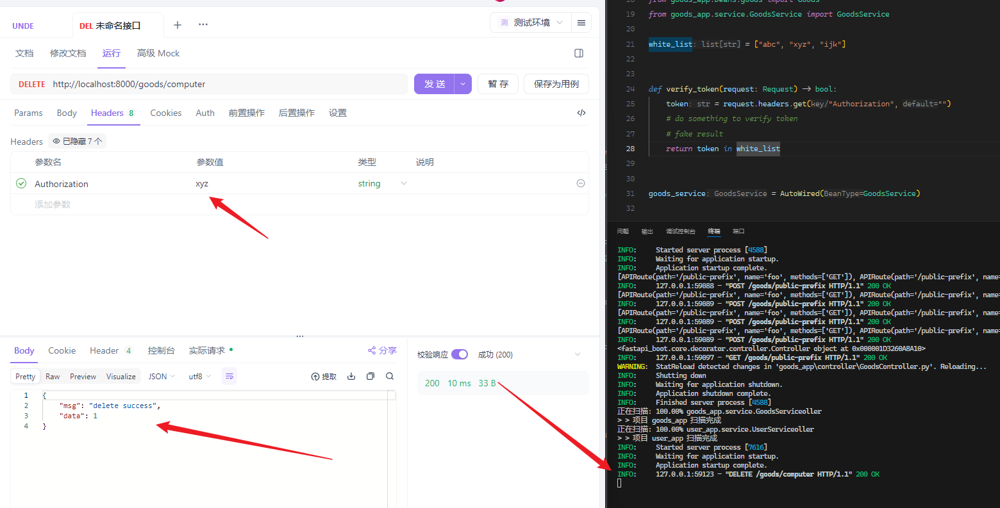 <br/>
之后再获取：
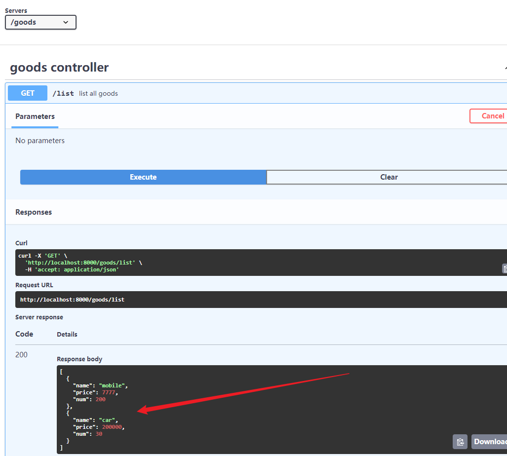

## 5. 简单示例

结构：
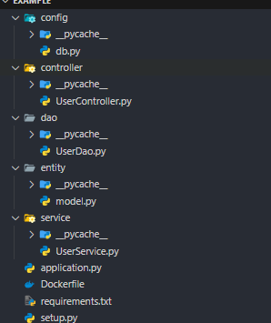
数据库相关：
:::code-group

```python[/config/db.py]
class DBConfig:
    HOST = "localhost"
    PORT = 3306
    DB_NAME = "fastapi_test"

```

```python[/setup.py]
from tortoise import Tortoise
from config.db import DBConfig


async def init_db():
    url = f"mysql://{DBConfig.HOST}:{DBConfig.PORT}/{DBConfig.DB_NAME}"
    await Tortoise.init(db_url=url, modules=dict(models=["entity.model"]))
    await Tortoise.generate_schemas()

```

```python[/entity/model.py]
from pydantic import BaseModel
from tortoise import fields
from tortoise.models import Model


class User(Model):
    id = fields.IntField(primary_key=True)
    username = fields.CharField(max_length=20)
    password = fields.CharField(max_length=32)
    age = fields.IntField()
    gender = fields.CharField(max_length=10)
    address = fields.CharField(32, default="")

    class Meta:
        table = "user"


class UserModel(BaseModel):
    id: int
    username: str
    password: str
    age: int
    gender: str
    address: str

    @staticmethod
    def from_User(user: User):
        return UserModel(
            id=user.id,
            username=user.username,
            password=user.password,
            age=user.age,
            address=user.address,
            gender=user.gender,
        )

    def to_update_dict(self):
        return dict(
            username=self.username,
            password=self.password,
            age=self.age,
            gender=self.gender,
            address=self.address,
        )

    def to_dict(self):
        return dict(id=self.id, **self.to_update_dict())


```

:::

其他：

:::code-group

```python[service/UserService.py]
from typing import Any, List, Mapping, Optional

from tortoise.queryset import QuerySet
from entity.model import User
from entity.model import UserModel
from fastapi_boot import Service


@Service
class UserService:
    async def add_user(self, user: UserModel):
        await User(**user.model_dump()).save()
        return dict(status="success", msg="添加成功")

    async def get_user_by_id(self, id: int) -> Optional[UserModel]:
        user: Optional[User] = await User.filter(id=id).first()
        return UserModel.from_User(user) if user else None

    async def get_user_by_username(self, username: str) -> List[Mapping[str, Any]]:
        userlist: List[User] = await User.filter(username=username)
        return [UserModel.from_User(u).to_dict() for u in userlist]

    async def listuser(self) -> List[Mapping[str, Any]]:
        return [UserModel.from_User(u).to_dict() for u in list(await User.filter())]

    async def delete_user_by_id(self, id: int) -> int:
        return await User.filter(id=id).delete()

    async def update_user(self, user: UserModel) -> int:
        curr_user: QuerySet[User] = User.filter(id=user.id)
        return (
            await curr_user.update(**user.to_update_dict())
            if await curr_user.count()
            else 0
        )

```

```python[/controller/UserController.py]
from typing import List
from fastapi import HTTPException, Path, Query, Request, status
from fastapi.responses import JSONResponse
from entity.model import UserModel
from fastapi_boot import Controller, Post, AutoWired, Get, Put, Delete, Prefix, useDep
from service.UserService import UserService

allow_list = ["zhangsan", "lisi", "wangwu", "zhaoliu"]


def verify_token(request: Request):
    token = request.headers.get("Authorization", "")
    if token not in allow_list:
        return False
    else:
        return True


user_service = AutoWired(UserService)


@Controller("/user", tags=["用户api"])
class UserController:
    @Post("", summary="添加用户", status_code=200)
    async def add_user(self, user: UserModel) -> JSONResponse:
        return JSONResponse(
            content=dict(msg="添加成功", data=await user_service.add_user(user))
        )

    @Get(
        "/list",
        summary="获取所有用户信息",
        response_model=List[UserModel],
        status_code=status.HTTP_200_OK,
    )
    async def listuser(self):
        return JSONResponse(
            content=dict(msg="获取成功", data=await user_service.listuser())
        )

    @Get("/{id}", summary="根据用户id获取用户信息", response_model=UserModel)
    async def get_user_by_id(self, id: int = Path()) -> JSONResponse:
        result = await user_service.get_user_by_id(id)
        return JSONResponse(
            content=dict(msg="获取成功", data=result.dict() if result else None)
        )

    @Get("/", summary="根据用户名获取用户信息", response_model=UserModel)
    async def get_user_by_username(self, username: str = Query()) -> JSONResponse:
        return JSONResponse(
            content=dict(
                msg="获取成功",
                data=await user_service.get_user_by_username(username),
            )
        )

    @Prefix()
    class DelAndUpdate:
        has_permission = useDep(verify_token)

        @Delete("/{id}", summary="根据id删除用户")
        async def delete_user_by_id(self, id: int = Path()) -> JSONResponse:
            if not self.has_permission:
                raise HTTPException(status_code=401, detail="has not permission")
            return JSONResponse(
                content=dict(
                    msg="删除成功", data=await user_service.delete_user_by_id(id)
                )
            )

        @Put("", summary="修改用户信息")
        async def update_user(self, user: UserModel) -> JSONResponse:
            if not self.has_permission:
                raise HTTPException(status_code=401, detail="has not permission")
            return JSONResponse(
                content=dict(
                    msg="修改成功",
                    data={"update_rows": await user_service.update_user(user)},
                )
            )

```

:::

启动：

:::code-group

```python[application.py]
import asyncio
from contextlib import asynccontextmanager
from fastapi import FastAPI
import uvicorn
from fastapi_boot.core.decorator.boot import FastApiBootApplication
from setup import init_db


@asynccontextmanager
async def lifespan(app: FastAPI):
    await init_db()
    FastApiBootApplication.run_app(app)
    yield


app = FastAPI(lifespan=lifespan)


async def main():
    uvicorn.run("application:app", reload=True)


if __name__ == "__main__":
    asyncio.run(main())

```

:::
